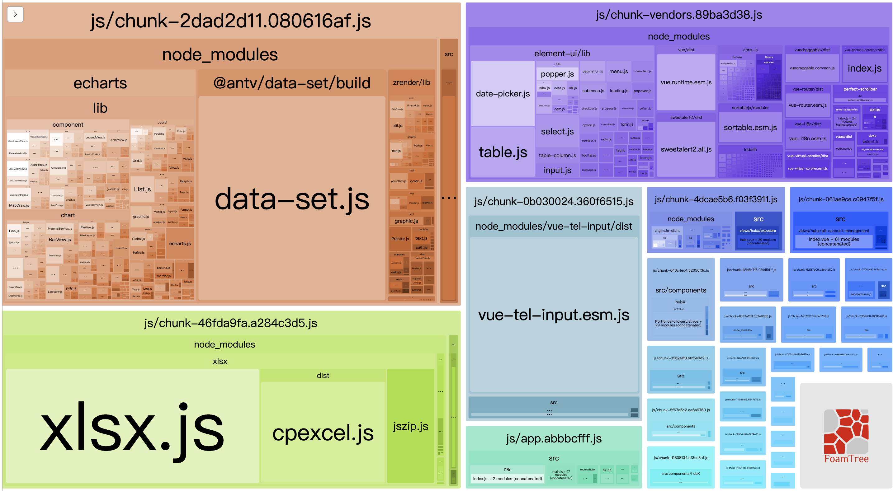

### LifeByte Project Summary

从C端到B端的开发，回顾下这一年来的工作内容，简单来说，发现了一些问题，然后解决了一些问题。

#### # 规范git提交规范

进入LifeByte，首先熟悉项目结构，web端没有涉及什么架构的内容，主要是业界常规的全家桶技术（vue + vue-router + axios)，复杂点的话就是结合业务做好权限的封装处理。在查看commit history的时候，我发现一年内竟然有6000+的提交，团队6个人，这个提交量实属让我有点惊讶。同时，团队的提交message都非常随意，很多commit从message信息中看不出包含的修改changelog，第一感觉就是很乱，继续这样下去，项目的维护越来越困难，于是我想应该强制规范团队成员的提交信息。

解决思路

在commit之前，增加一层拦截处理，判断commit message是否符合规范，不符合的则提交失败。

> 这个解决方案是在阅读vue源码中发现的，致敬尤雨溪前辈。

引入[husky](https://github.com/typicode/husky), 在触发`commit-msg`钩子 的时候，运行脚本。配置如下：

```json
// package.json
{
  // add
  "husky": {
        "hooks": {
            "commit-msg": "node scripts/verify-commit-msg.js"
        }
    },
}
```

脚本中获取commit message文本，运用正则匹配，不符合则通过`process.exit(1)`退出进程，阻止commit行为，具体代码如下：

```js
// scripts/verify-commit-msg.js

const chalk = require('chalk');
const msgPath = process.env.HUSKY_GIT_PARAMS;
const msg = require('fs')
    .readFileSync(msgPath, 'utf-8')
    .trim();

const commitRE = /^(revert: )?(feat|fix|docs|style|refactor|perf|test|workflow|ci|chore|types|build)(\(.+\))?: .{1,50}/;
// 如果是merge产生的自然提交，允许通过
if (/^Merge branch/.test(msg)) {
    return;
}
if (!commitRE.test(msg)) {
    console.error(
        `  ${chalk.bgRed.white(' ERROR ')} ${chalk.red(`不规范的 git commit message 格式`)}\n\n` +
            chalk.red(`  请简略描述提交的类型、涉及模块以及简要。例如：\n\n`) +
            `    ${chalk.green(`feat(compiler): add 'comments' option`)}\n` +
            `    ${chalk.green(`fix(ci): handle events on blur (close #28)`)}\n\n` +
            chalk.red(`  详情请查阅 standard.md(#25)。\n`)
    );
    process.exit(1);
}
```

commit message 目前参考自[Angular's commit convention](https://github.com/conventional-changelog/conventional-changelog)，基本格式如下：

<type>(<scope>): <subject>

*_type_* 代表某次提交的类型，比如是修复一个 bug 还是增加一个新的 feature。所有的 type 类型如下：

\-   feat： 新增 feature；

\-   fix: 修复 bug；

\-   docs: 仅仅修改了文档，比如 README, CHANGELOG, CONTRIBUTE 等等；

\-   style: 仅仅修改了空格、格式缩进、都好等等，不改变代码逻辑；

\-   refactor: 代码重构，没有加新功能或者修复 bug；

\-   perf: 优化相关，比如提升性能、体验；

\-   test: 测试用例，包括单元测试、集成测试等；

\-   chore: 一般用来发布版本；

\-   build: 改变构建流程、或者增加依赖库、工具等；

\-   revert: 回滚到上一个版本；

\-   ci: git ci 相关修改；

每次提交时候，会检测提交信息是否包含以上类型，如果没有，将会提交失败，目的在于规范会员每一次提交都是有意义，可追踪的。例子如下：

```
feat(common style): add global style

fix(Payment): fix case 'xxxx'

test(IB Management): run unit test

chore(beta1.0): release beta1.0
```

同时上面说到提交记录过多，我发现团队同事的提交都比较分散，明明只新增了一个新功能或修复了一个case，却有好几个提交，这种会导致代码的修改记录分散，review代码时候十分不方便。于是我建议在新增一个feature或者bugfix的时候，善于使用`git rebase -i`这个命令，合并一个commit推送到remote仓库，减少不必要的git history。

#### 统一规范代码格式

项目原本已经有了一套Eslint格式规范，但在实际的开发的过程中，还是会因为团队同事的编码工具不同，编码习惯等造成格式没办法统一的情况。还有一个问题，Eslint没办法格式化vue template中的html内容，造成项目代码有几种不同的格式风格。于是参考了业界的一些用法，引入了prettier。

Eslint + Prettier的使用可以比较完美解决了存在的问题了，EsLint负责语法上面的一些检查，比如是否存在未使用的变量之类的，而代码格式全部交给Prettier规范处理。这里存在一个问题，Eslint与Prettier存在格式冲突的情况，因为原本项目已经存在大量代码，而且还是沿用了以前旧的Eslint规范，网上的资料参差不齐（强烈推荐去官方文档查阅资料），这里爬了一会坑最终才把问题解决了。

具体的处理方法：

a.安装依赖库

```
 npm i eslint-config-prettier eslint-plugin-prettier prettier -D
```

b.修改eslintrc.js配置文件

```js
module.exports = {
    root: true,
    env: {
        node: true
    },
    extends: ['plugin:vue/essential', 'plugin:prettier/recommended', 'eslint:recommended'], 
    rules: {
        'no-console': 'off',
        'no-debugger': 'off',
        'prettier/prettier': 'error'
    },
    parserOptions: {
        parser: 'babel-eslint'
    },
};
```

c.在husky的pre-commit钩子增加`eslint --fix`即可在提交之前自动执行代码格式化，lint-staged是指只针对git暂存区的文件进行格式化。

```joson
 // package.json
{
 "husky": {
        "hooks": {
            "pre-commit": "lint-staged",
        }
    },
    "lint-staged": {
        "src/**/*.{js,vue}": [
            "eslint --fix",
        ]
    }
}
```

#### #优化webpack打包与缓存策略

项目一直以来都是采取webpack默认的打包规则，通过npm run build后，直接部署到生产环境。随着项目的功能日渐增加，引入的依赖库也越来越多，因此考虑在打包方面能否优化一下。

首先查看项目的打包情况，网上资料很多说安装`webpack-bundle-analyzer`,  作为webpack plugin引入，其实vue-cli-service中已经配置好一些默认配置，所以有什么问题建议还是先阅读官方文档，往往能得到更好更高效的解决方案。vue-cli-service的用法如下：

```text
用法：vue-cli-service serve [options] [entry]

选项：

  --open    在服务器启动时打开浏览器
  --copy    在服务器启动时将 URL 复制到剪切版
  --mode    指定环境模式 (默认值：development)
  --host    指定 host (默认值：0.0.0.0)
  --port    指定 port (默认值：8080)
  --https   使用 https (默认值：false)
```

因此需要在package.json增加一个命令

```json
// package.json
{
 "scripts": {
    "report": "vue-cli-service build --report"
  }
}
```

运行npm run report，打包完成会在dist目录下生成report.html。



在优化之前，打包的原始文件占比竟然达到了10.9Mb，在报告中发现存在把多个不必要的npm插件打包到同一个js文件，造成体积过大的情况，后来参考了[vue-admin-template](https://github.com/PanJiaChen/vue-admin-template/blob/master/vue.config.js)的打包规则，具体的思路这篇文章也有说，[传送门](https://juejin.im/entry/5b784651e51d4538d04180a7)。

按照自己的理解简单总结下：

1.单独打包element-ui

2.node_module下的依赖库，单独打包成一个chunk

3.对项目src/components下的公共组件拆出一个chunk

4.提取runtime.js, 充分利用浏览器缓存，减少不必要的http网络请求

采用上面的打包策划后，重新生成打包报告，打包的体积已经减少到7M了，效果还是非常理想的。但是在报告中，发现有些插件的体积还是占有比较大，其中像echarts, xlsx这些插件竟然分别占用了2M多，因此虑通过CDN的方式引入。最终的vue.config.js配置为：

```js
// vue.config.js
const CDN = require('./cdn.json');

const path = require('path');
function resolve(dir) {
    return path.join(__dirname, dir);
}

module.exports = {
    // 默认在生成的静态资源文件名中包含hash以控制缓存
    filenameHashing: true,

    // 如果你不需要生产环境的 source map，可以将其设置为 false 以加速生产环境构建
    productionSourceMap: false,

    lintOnSave: false,

    configureWebpack: {
        // provide the app's title in webpack's name field, so that
        // it can be accessed in index.html to inject the correct title.
        resolve: {
            alias: {
                '@': resolve('src'),
            },
        },
        externals: {
            echarts: 'echarts',
            xlsx: 'XLSX',
            '@antv/data-set': 'DataSet',
            'vue-tel-input': 'VueTelInput',
        },
    },

    chainWebpack: (config) => {
        if (process.env.use_analyzer) {
            config.plugin('webpack-bundle-analyzer').use(require('webpack-bundle-analyzer').BundleAnalyzerPlugin);
        }

        config.plugin('html').tap((args) => {
            args[0].cdn = CDN;
            return args;
        });

        config.when(process.env.NODE_ENV !== 'development', (config) => {
            config.plugin('ScriptExtHtmlWebpackPlugin').after('html').use('script-ext-html-webpack-plugin').end();
            config.optimization.splitChunks({
                chunks: 'all',
                cacheGroups: {
                    libs: {
                        name: 'chunk-libs',
                        test: /[\\/]node_modules[\\/]/,
                        priority: 10,
                        chunks: 'initial',
                    },
                    elementUI: {
                        name: 'chunk-elementUI',
                        priority: 20,
                        test: /[\\/]node_modules[\\/]_?element-ui(.*)/,
                    },
                    commons: {
                        name: 'chunk-commons',
                        test: resolve('src/components/hubX/Frame'),
                        minChunks: 3,
                        priority: 5,
                        reuseExistingChunk: true,
                    },
                },
            });
            config.optimization.runtimeChunk('single');
        });
    },
};
```

别忘记了模版index.html注入模版：

```html
        <!-- 使用CDN的JS文件 -->
    <% for (var i in htmlWebpackPlugin.options.cdn && htmlWebpackPlugin.options.cdn.js) { %>
      <link href="<%= htmlWebpackPlugin.options.cdn.js[i] %>" rel="preload" as="script" />
    <% } %>
```

关于CDN引入，在webpack的externals属性爬了一个小坑，这个属性是告知webpack在打包过程中需要忽略哪些依赖。具体配置方式可以参考官方文档，本项目中采取了key-value结构，key对于是业务代码中引入的名称，value则是CDN引入后暴露到window下的全局变量名称。

最后再生成打包report，大小已经减少到4.05Mb，从10.9Mb到4.05Mb，大概减少了50%，这个结果已经非常满意了，当然还有其他可以进行优化的地方，比如在app.js一进来就加载cdn插件，是否考虑按需加载，开启gzip压缩等等，因为涉及时间问题，就暂时到这里了，优化的路上感觉是没有尽头的。。

最终的report贴个图：


说回缓存策略的原理，我们尽可能希望每次打包只更新有改动的文件，如果只修改了until的一个方法，把所有文件重新打包一遍，却导致所有浏览器缓存都失效了，那就不太合理了。在webpack中，开启`config.optimization.runtimeChunk('single')`, webpack在打包的时候，会生成一个runtime.xxx.js文件。它的作用是将包含`chunks 映射关系的 list`单独从 `app.js`里提取出来，因为每一个 chunk 的 id 基本都是基于内容 hash 出来的，所以你每次改动都会影响它，如果不将它提取出来的话，等于`app.js`每次都会改变。缓存就失效了。

#### 其他

接下来简单总结下能想到与业务相关的一些东西。

##### style样式管理

分为以下几个方向

1. 全局样式变量的定义

2. 第三方UI库样式的复写

3. 兼容不同浏览器

4. 响应式布局

目前需求多数会对项目进行差异化发布，以区分基础版本和升级版本。对于前端来说，除了功能的权限控制外，还需要考虑一点就是如何优雅地拓展项目的主题。

首先，应该要求设计提供一套统一的样式标注，在开发的时候尽可能定义好全局的主题标注，样式函数，写样式时候引用全局的变量，方便以后的迭代。对于全局的样式，统一好命名规范，避免因团队成员的开发习惯而造成样式混乱的情况，影响后期维护。

其次，最好以模版的方式定义样式文件，一个.scss文件应该有独立的职责，需要注意样式引入的顺序，避免样式被覆盖。

- animate.scss => 动画样式

- publish.scss => 全局样式

- color.scss => 全局颜色变量

- response.scss => 响应式布局调整

- element.scss => 复写的第三方库

- ....

##### 组件/指令的封装

对于组件，指令封装，目的是为了提供一个对外的接口，让其他同事不需要了解内部实现，能够便捷地使用起来。例如提供v-perimission-click控制权限点击，v-input-limit控制输入等等。这一块比较杂，感觉也没什么好总结的，就这样啦～

溜了溜了，路漫漫其修远兮，保持努力与思考哈～～
